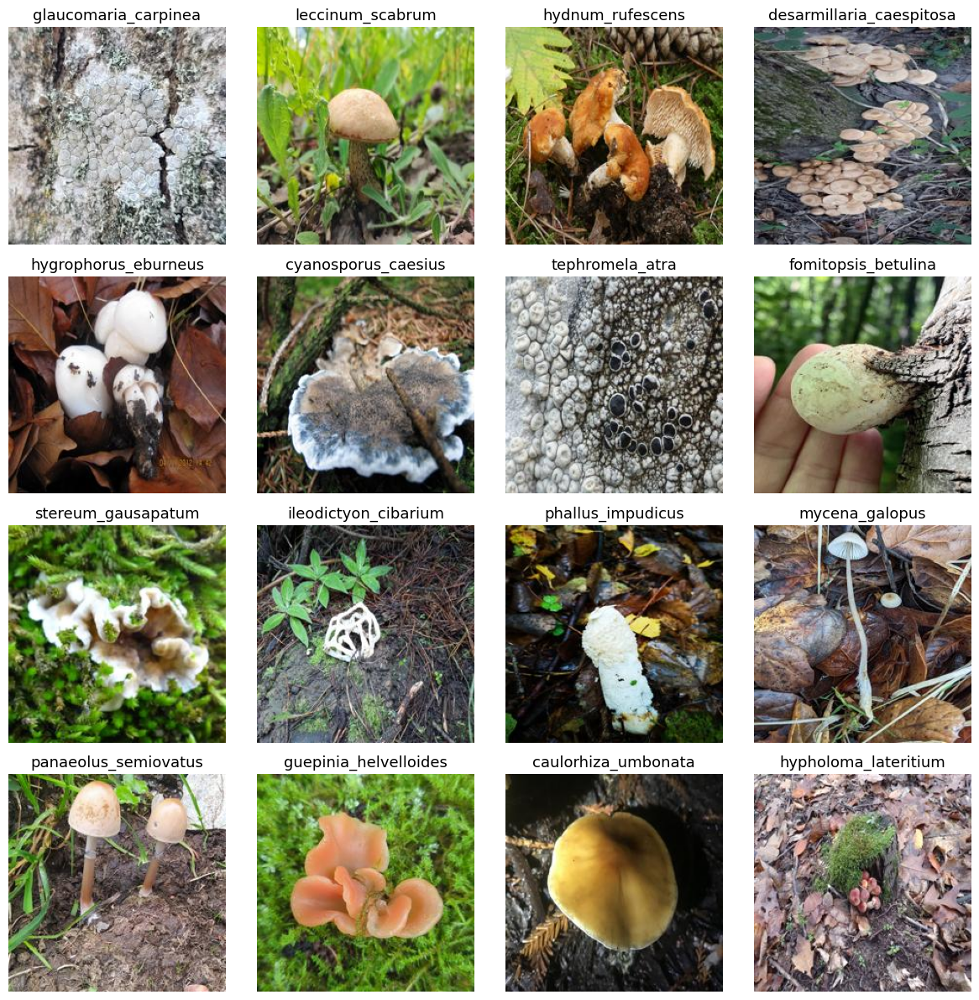

# ShroomAI
Mushroom classification using a dataset scraped from [GBIF (Global Biodiversity Information Facility)](https://www.gbif.org/). 

🍄 Check out the [app version](https://github.com/Seohyeong/ShroomScanner/tree/main)!

## About the Dataset
The dataset used in this project comprises 300 mushroom images representing 1,000 different species. These species were selected based on the most commonly observed ones from iNaturalist Research-grade observations collected between 2000 and 2024, sourced from the [GBIF (Global Biodiversity Information Facility)](https://www.gbif.org/). 

Each image is associated with a specific species, selected from a hierarchical taxonomy that includes multiple layers such as family, phylum, class, order, and species. `Species` is used as labels for the images in the dataset. For further details, refer to `preprocess/preprocess.ipynb` and `preprocess/get_images.py`.

### Citation
```
GBIF.org (02 October 2024) GBIF Occurrence Download  https://doi.org/10.15468/dl.mu3ech
```

### Examples
These are 16 image/label pairs from the collected dataset.




## About the Model
The backbone models used in this project are MobileNetV2 and Efficientnet-B0. Since the number of classes matches that of the ImageNet dataset, no modification to the architecture have been made. 

Training is done in two stages: training the classification head while keeping the rest of the model frozen and then training the entire model. The learning rate used in the classification head training is referred to as `partial` or `pretraining` (although it's not an entirely accurate term) and the learning rate used for training the full network is referred to as  `full` or `finetuning`.

### Experimental Results
| Backbone         | # params   | lr (partial/full) | ckpt |
|------------------|------------|-------------------|------|
| mobilenet_v2     | 3,504,872  |       |  | |
| efficientnet_b0  | 5,288,548  |      |  | |


## Usuage

### Setup
```bash
conda env create -f environment.yml
```

### Training the Model
```bash
# example
CUDA_VISIBLE_DEVICES=0, python ShroomAI/run.py \
  --dataset_dir_path {path_to_dataset} \
  --pretrain \
  --finetune \
  --model_name {'mobilenet_v2' or 'efficientnet_b0'} \
  --img_size 224 \
  --pt_bs 1024 \
  --ft_bs 256 \
  --eval_bs 1024 \
  --pt_epoch 20 \
  --ft_epoch 30 \
  --pt_lr 0.0005 \
  --ft_lr 0.00001
```

### Converting the Checkpoint
```bash
# example
python ShroomAI/scripts/convert_to_coreml.py \
  --model_path {path to model ckpt} \
  --label_map_path {path to label map} \
  --num_classes 1000 \
  --img_size 224 \
  --set_meta_data
```
