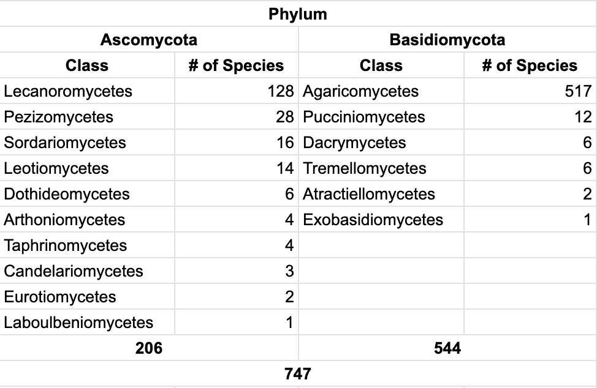

# About the Dataset
Mushroom images dataset collected from https://www.gbif.org/


## Dataset Download

### Download Information
```
DOI: https://doi.org/10.15468/dl.ymrpej (may take some hours before being active)
Creation Date: 07:27:46 13 July 2024
Records included: 41968776 records from 3941 published datasets
Compressed data size: 15.1 GB
Download format: DWCA
Filter used:

{
  "TaxonKey" : [
    "is Fungi"
  ]
}
```

### Citation
```
GBIF.org (13 July 2024) GBIF Occurrence Download https://doi.org/10.15468/dl.ymrpej
```


## Dataset Strcture
```
./raw
    ├── citations.txt
    ├── meta.xml
    ├── metadata.xml
    ├── multimedia.txt
    ├── occurrence.txt
    ├── rights.txt
    └── verbatim.txt
```
From the downloaded dataset, this project uses `multimedia.txt` and `occurrence.txt` to create a train-ready dataset.

Each row of `occurrence.txt` represents a single occurrence of an event, including information regarding taxonomy, location, and observations. Each occurrence is assigned a unique `gbifID`. The key columns this project works with are `gbifID`, `basisOfRecord`, `phylum`, and `species`.

Each row of `multimedia.txt` represents a single image in the GBIF database. Different images can share the same gbifID because the ID is assigned to a unique occurrence event rather than a unique image (multiple images can be linked to a single observation occurrence event). The main columns for the data preprocessing step are `gbifID` and `identifier`, which contains the URL of the image.


## Dataset Preprocessing
The purpose of this step is to filter out samples and link image URLs to occurrences. This completes a single dataframe that can be used to scrape images from the web.

### Taxonomy Hierachy of Fungi (from general to specific)
- Domain – highest level constitutes three domains of life
- Kingdom – the second most level constitutes five kingdoms
- Phylum – a group of related classes
- Class – a group of related orders
- Order – a group of related families
- Family – a group of related genera
- Genus – a group of related species
- Species – a group of similar organisms

### Statistics of Phylum of Downloaded Dataset
| Phylum  | # of Occurrence |
| ------------- | ------------- |
| Basidiomycota  |  ~ 20,000,000  |
| Ascomycota  | ~ 20,000,000  |
| Mucoromycota  | ~ 700,000  |
| Chytridiomycota  | ~ 200,000 |
| Glomeromycota  | ~ 150,000  |
| Zoopagomycota  | ~ 50,000 |
...

`occurrence.txt` is first filtered to include only rows with a phylum of either **Basidiomycota** or **Ascomycota** (from which edible mushrooms originate). It is then inner joined with `multimedia.txt` using `gbifID` as the key. In cases where there are overlapping gbifIDs, the first row from multimedia.txt that matches the gbifID is used. For further details, refer to `preprocess/preprocess.py` and `preprocess/get_images.py`.

The `species` column serves as a label, and only species with more than 1,000 occurrences are included (resulting in 1,000 images per class). This process yields a total of **747** mushroom species classes.


## Statistics

### Statistics of Taxonomy


### Statistics of Dataset
TBU