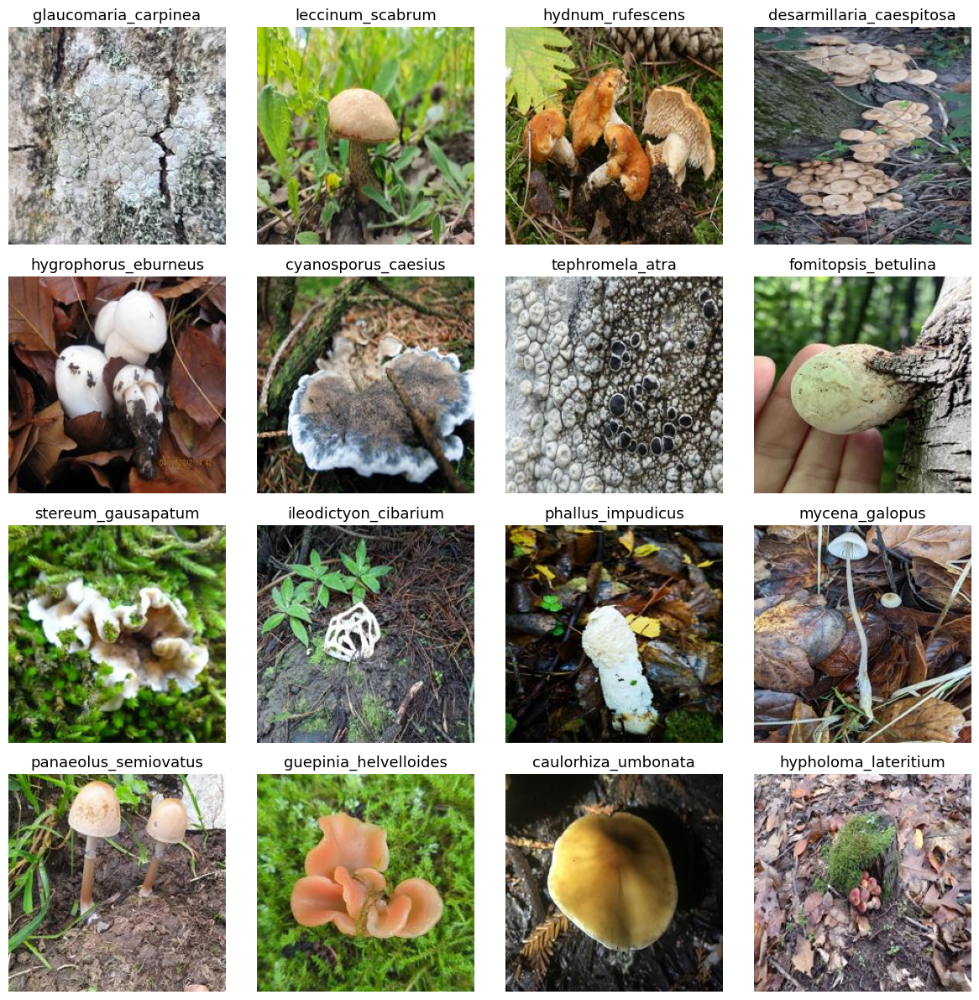

# About the Dataset
This dataset consists of mushroom images (iNaturalist Research-grade Observations, between start of 2000 and end of 2024) collected from [GBIF (Global Biodiversity Information Facility)](https://www.gbif.org/). 
Each image is associated with a specific species, selected from a hierarchical taxonomy that includes multiple layers such as family, phylum, class, order, and species. `Species` is used as labels for the images in the dataset.

**Dataset Details**  
Total Species: 1,000  
Images per Species: Approximately 300 

The dataset is intended for research and exploration of mushroom species diversity and visual identification.

## Dataset Download

### Download Information
```
DOI: https://doi.org/10.15468/dl.mu3ech (may take some hours before being active)
Creation Date: 03:27:51 2 October 2024
Records included: 2702165 records from 1 published datasets
Compressed data size: 1.6 GB
Download format: DWCA
Filter used:

{
  "and" : [
    "DatasetKey is iNaturalist Research-grade Observations",
    "HasCoordinate is true",
    "HasGeospatialIssue is false",
    "OccurrenceStatus is Present",
    "TaxonKey is Fungi",
    "Year 2000-2024"
  ]
}
```

### Citation
```
GBIF.org (02 October 2024) GBIF Occurrence Download  https://doi.org/10.15468/dl.mu3ech
```


## Downloaded Dataset Strcture
```
./raw_inat
    ├── citations.txt
    ├── meta.xml
    ├── metadata.xml
    ├── multimedia.txt
    ├── occurrence.txt
    ├── rights.txt
    └── verbatim.txt
```
From the downloaded dataset, this project uses `multimedia.txt` and `occurrence.txt` to create a train-ready dataset.

Each row of `occurrence.txt` represents a single occurrence of an event, including information regarding taxonomy, location, and observations. Each occurrence is assigned a unique `gbifID`.

Each row of `multimedia.txt` represents a single image in the GBIF database. Different images can share the same gbifID because the ID is assigned to a unique occurrence event rather than a unique image (multiple images can be linked to a single observation occurrence event).


## Dataset Preprocessing
The purpose of this step is to filter out samples and link image URLs to occurrences. This completes a single dataframe that can be used to scrape images from the web.

### Taxonomy Hierachy of Fungi (from general to specific)
- Domain – highest level constitutes three domains of life
- Kingdom – the second most level constitutes five kingdoms
- Phylum – a group of related classes
- Class – a group of related orders
- Order – a group of related families
- Family – a group of related genera
- Genus – a group of related species
- Species – a group of similar organisms

### Basic Preprocessing Procedure
`occurrence.txt` is first filtered to include only rows with a phylum of either **Basidiomycota** or **Ascomycota** (from which edible mushrooms originate). It is then inner joined with `multimedia.txt` using `gbifID` as the key. Images from year 2024 are used as validation split and the rest is used as train split. For further details, refer to `preprocess/preprocess.ipynb` and `preprocess/get_images.py`.

The `species` column serves as a label. Top 1,000 most common species in the category of phylum Basidiomycota or Ascomycota. For the training dataset, 300 images are randomly scraped for each species from occurrences in between year 2020 and 2023. For the validation dataset, 30 images are randomly scraped from occurrences in year 2024.

### Dataset Structure
Final structure of the collected dataset.

```
./inat_300
    ├── train                             // train split
    │     ├── Abortiporus biennis         // folder (species as name)
    │     │     ├── XXXXXXXXXX.jpg        // image  (gbifID as name)
    │     │     ├── ...
    │     │     └── XXXXXXXXXX.jpg
    │     │     
    │     ├── ...
    │     │     ├── ...
    │     │     ├── ...
    │     │     └── ...
    │     │
    │     └── xylodon_radula
    │           ├── XXXXXXXXXX.jpg
    │           ├── ...
    │           └── XXXXXXXXXX.jpg
    │
    └── val                              // val split
          ├── Abortiporus biennis
          │     ├── XXXXXXXXXX.jpg
          │     ├── ...
          │     └── XXXXXXXXXX.jpg
          │
          ├── ...
          │     ├── ...
          │     ├── ...
          │     └── ...
          │
          └── xylodon_radula
                ├── 3716172922.jng
                ├── ...
                └── 7528392372.jng
```

### Examples
These are 16 image/label pairs from the collected dataset.


